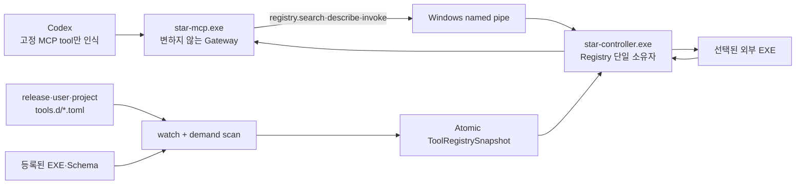

# 무재시작 외부 Tool Registry와 고정형 MCP Gateway

## 확정 요구

사용자가 원하는 최종 동작은 다음과 같다.

```text
새 EXE 연결
  -> TOML 추가·수정
  -> 실행 중 Registry가 자동 반영
  -> 같은 Codex 작업에서 즉시 검색·설명·실행

필요하지 않은 것
  -> star-mcp.exe 재빌드
  -> MCP 재등록
  -> MCP process 재시작
  -> Codex 재시작
```

이를 확실하게 보장하려면 외부 EXE마다 새로운 MCP tool 이름을 노출하면 안 된다. Codex가 처음부터 알고 있는 **고정 generic MCP tool**만 두고, 실제 개발 도구 목록·Schema·실행법은 Controller의 live Registry에서 조회한다. 정확한 v1 field·기본값·state machine은 [MCP 구현 동결 계약](mcp-implementation-contract.md)과 [ToolPackageManifest Reference](tool-package-manifest-reference.md)가 소유한다.

Codex에는 Gateway 하나만 한 번 등록한다.

```toml
[mcp_servers.star_control]
command = 'C:\Program Files\Star-Control\star-mcp.exe'
required = true
startup_timeout_sec = 20
tool_timeout_sec = 600
```

새 EXE를 추가할 때 Codex `config.toml`은 바꾸지 않는다.

## 일반 MCP tool과의 차이

| 영역 | 일반적인 MCP server | Star-Control 고정 Gateway |
|---|---|---|
| tool 목록 | 실제 tool마다 MCP 이름을 노출 | generic tool 이름만 항상 고정 |
| 새 tool 반영 | `tools/list` 갱신이 client에 반영돼야 함 | Registry search 결과만 바뀌므로 client 갱신 불필요 |
| 입력 Schema | 실제 tool의 Schema를 MCP가 직접 제공 | `star_tool_describe`가 실제 Schema와 descriptor hash 제공 |
| 호출 | 실제 MCP tool 이름으로 직접 호출 | risk lane tool에 `tool_id`, hash, arguments 전달 |
| 위험 표시 | 실제 tool별 annotation | 고정 risk lane별 annotation + Controller PermissionPlan |
| 구현·수명 | MCP server가 tool code와 상태를 직접 소유 | Controller가 매 call의 core backend·child EXE를 조정 |
| 신뢰 단위 | 등록한 MCP server 하나 | source·manifest·Schema·EXE·output을 각각 검증 |
| 준비 상태 | server initialize 성공 중심 | action마다 설치·version·runtime·license·project 조건 확인 |
| 장기 실행 | client의 progress·task 지원에 영향 | OperationId·조회·취소를 항상 제공하고 MCP 기능은 선택적 보강 |
| 취소·격리 | server 구현에 의존 | Controller가 deadline·Job Object·process tree·lock 관리 |
| 설정 변경 | host가 tool-list 변경을 처리해야 할 수 있음 | Controller가 TOML만 live reload |
| 오류 | MCP tool 자체 오류 | Registry·Schema·EXE·protocol·실행 오류를 단계별로 구분 |

MCP 규격 자체에는 `tools.listChanged`, tool별 input·output Schema, annotation과 task support가 있다. 그러나 현재 Codex MCP 지원 문서는 실행 중 tool-list 갱신을 지원 기능으로 명시하지 않는다. Star-Control은 이 차이를 generic surface로 제거한다.

## 전체 구조



이전 설계처럼 `star-mcp.exe`와 Controller가 TOML을 각각 읽지 않는다. 두 process가 서로 다른 시점의 설정을 읽는 문제를 없애기 위해 **Controller만 Registry를 읽고 갱신한다.** `star-mcp.exe`는 매 MCP call을 IPC로 전달하는 얇은 고정 Gateway다.

## `star-mcp.exe`의 고정 책임

### 포함

- STDIO MCP initialize와 고정 server instructions
- 아래 정의한 고정 generic MCP tool의 Schema 제공
- MCP call과 Controller IPC request·response 변환
- MCP request cancellation을 Controller operation cancellation에 연결
- Controller readiness와 protocol 오류 표시

### 포함하지 않음

- 외부 tool 이름·설명·EXE path
- TOML·JSON Schema parsing과 file watcher
- 실제 tool별 input Schema와 argument binding
- EXE 실행과 tool별 stdout parser
- 권한·유료 여부·완료 판단
- 상태·evidence 직접 쓰기

새 EXE, 새 subcommand와 새 argument 때문에 `star-mcp.exe` source가 바뀌면 구조 위반이다.

## 고정 MCP surface

### 발견·설명·상태

| MCP tool | 역할 | annotation 성격 |
|---|---|---|
| `star_tool_search` | 목적·tag·project·readiness로 tool 후보 검색 | read-only, closed world |
| `star_tool_describe` | 한 tool의 전체 Schema·예시·권한·현재 EXE 정보 조회 | read-only, closed world |
| `star_tool_registry_status` | reload revision, invalid package와 사용 불가 EXE 조회 | read-only, closed world |
| `star_tool_operation_get` | 장기 실행 진행·결과 조회 | read-only, closed world |
| `star_tool_operation_cancel` | 실행 중 operation 취소 | destructive, open world |
| `star_approval_resolve` | Registry tool 실행에 필요한 사용자 결정 기록 | destructive, open world |

### 실행 risk lane

실제 tool별 MCP annotation을 잃지 않도록 행동 조합별 generic call을 고정한다.

| MCP tool | `readOnlyHint` | `destructiveHint` | `openWorldHint` | 사용 대상 |
|---|---:|---:|---:|---|
| `star_tool_call_read_closed` | true | false | false | 로컬 조회·분석 |
| `star_tool_call_read_open` | true | false | true | 인터넷·외부 시스템 읽기 |
| `star_tool_call_write_closed` | false | false | false | 로컬 추가·수정 |
| `star_tool_call_destructive_closed` | false | true | false | 로컬 삭제·덮어쓰기·system 변경 |
| `star_tool_call_write_open` | false | false | true | 외부 ticket·PR 등 추가·수정 |
| `star_tool_call_destructive_open` | false | true | true | 외부 삭제·publish·취소 불가 변경 |

Registry는 ToolDescriptor의 Permission ActionId set에서 lane을 계산한다. TOML이 lane을 직접 낮춰 지정하지 못한다. `star_tool_describe`는 사용할 정확한 MCP lane 이름을 반환하고 Controller는 다른 lane으로 온 호출을 거부한다.

여섯 실행 lane의 `idempotentHint`는 실제 action마다 다르고 read lane도 process 실행을 포함할 수 있으므로 모두 보수적으로 false다. search·describe·status·Operation 조회만 true다. 유료 여부는 MCP annotation에 대응 항목이 없으므로 PermissionPlan과 ApprovalRequest가 별도로 처리한다.

## 발견→설명→실행 흐름

```text
1. star_tool_search
   -> tool_id, 한 줄 설명, readiness, risk lane

2. star_tool_describe(tool_id)
   -> 전체 input Schema, 예시, descriptor_hash, registry_revision

3. describe가 알려 준 star_tool_call_* 호출
   -> tool_id + descriptor_hash + arguments

4. Controller가 최신 descriptor와 hash를 다시 검사
   -> 실행 또는 stale·approval_required 반환
```

`star_tool_call_*`의 고정 input은 다음과 같다.

| field | 필수 | 의미 |
|---|---:|---|
| `tool_id` | 예 | Registry의 stable tool ID |
| `descriptor_hash` | 예 | describe에서 받은 tool 계약 hash |
| `arguments` | 예 | 실제 tool input object |
| `goal_id`, `stage_id` | 조건부 | Star-Control Goal 안에서 실행할 때의 범위 |
| `idempotency_key` | mutation | 재전송 중복 방지 |
| `wait_mode` | 아니요 | `auto`, `wait`, `detach` |

실제 input Schema는 generic MCP Schema 안의 `arguments`에 직접 펼칠 수 없으므로 Controller가 describe 시점과 실행 직전에 검사한다. descriptor가 바뀌면 `TOOL_DESCRIPTOR_STALE`로 거부하고 다시 describe하도록 한다. 모델이 오래된 CLI 인자를 실행하는 것을 허용하지 않는다.

## Tool 검색에 필요한 metadata

고정 surface에서는 Codex가 실제 tool 목록을 미리 보지 못하므로 검색 품질이 중요하다. ToolDescriptor는 다음 metadata를 가진다.

| field | 의미 |
|---|---|
| `tool_id` | namespace를 포함한 stable ID |
| `display_name` | 사용자 표시 이름 |
| `summary` | 검색 결과용 한 줄 설명 |
| `description` | 기능·입력·결과의 상세 설명 |
| `aliases` | 사용자가 부를 수 있는 다른 이름 |
| `tags` | `search`, `test`, `git`, `schema` 같은 분류 |
| `task_kinds` | format·lint·build·test·analyze 등 |
| `when_to_use` | 적합한 조건 |
| `when_not_to_use` | 피해야 할 조건 |
| `examples` | 짧은 입력·목적 예시 |
| `project_requirements` | 필요한 파일·언어·toolchain |
| `platforms`, `architectures` | 지원 Windows·CPU |
| `readiness` | ready, unavailable, untrusted, incompatible, degraded |
| `permission_actions` | 실행에 필요한 모든 ActionId |
| `paid_action` | yes, no, unknown |
| `result_kinds` | text, diagnostic, artifact, structured data |

검색은 local AI나 embedding을 쓰지 않는다. exact ID·alias, tag, task kind와 설명 token을 이용한 결정적 순위를 사용한다. 결과 수와 설명 길이를 제한해 tool 수가 많아져도 Codex context를 낭비하지 않는다.

## Registry source와 우선순위

| source | 기본 위치 | 신뢰 경계 |
|---|---|---|
| release | `<install>\catalog\tool-packages\*.toml` | 설치 package checksum·서명 |
| user | `%APPDATA%\Star-Control\tools.d\*.toml` | 사용자가 직접 관리, 정책 Profile에 따라 등록 의도 확인 |
| project | `<project>\.star-control\tools.d\*.toml` | local trust store에서 별도 신뢰 |

같은 `package_id`·`package_version`인데 내용이 다르면 우선순위로 덮지 않는다. 명시적 `replaces`와 trust가 없으면 충돌이다. project source는 user의 permission·환경·secret 제한을 넓힐 수 없다.

`safe_default`는 새 user package와 새 executable path를 처음 사용할 때 trust 확인을 요구한다. `personal_auto`는 사용자가 관리 root에 직접 저장한 valid user manifest를 등록 의도로 보고 non-paid action을 추가 확인 없이 사용할 수 있다. 두 Profile 모두 project source는 별도 trust가 필요하고, 유료·미확인 비용과 상위 Codex 승인은 그대로 유지한다.

### Core action과 외부 process backend

Registry는 두 backend를 같은 discovery 흐름에 넣되 신뢰 경계를 섞지 않는다.

| backend | 허용 source | 실행 방식 |
|---|---|---|
| `controller_command` | 서명·checksum이 검증된 required release package만 | 미리 구현된 typed application command 호출 |
| `process` | release·user·trusted project | ExecutableDescriptor를 통해 child EXE 실행 |

user·project package가 `controller_command`, 임의 IPC command와 내부 Rust handler 이름을 참조하면 거부한다. release core package도 Controller에 존재하지 않는 command를 새로 만들어 내지 못한다. core package 변경은 MCP Gateway가 아니라 Controller capability와 product version 호환 검사를 거친다.

## Live reload 계약

### 변경 발견

Controller는 두 방식을 함께 사용한다.

1. Windows file watcher로 manifest·Schema·등록 EXE 변경을 감지한다.
2. `search`, `describe`, `invoke` 직전에 source의 file identity·수정 시각·크기를 demand scan한다.

file watcher event가 누락돼도 다음 사용 전에 변경을 찾는다. 주기적으로 실행되는 자체 scheduler는 만들지 않는다.

### 안전한 reload

1. 변경 event를 짧게 모아 editor의 연속 저장을 한 번으로 처리한다.
2. 파일 크기와 수정 시각이 안정될 때까지 candidate를 읽지 않는다.
3. 변경 package의 TOML, Schema, executable identity와 reference를 전부 검증한다.
4. 해당 package의 immutable PackageSnapshot을 만든다.
5. valid package snapshot들을 한 RegistrySnapshot으로 조합한다.
6. 완성된 snapshot pointer를 한 번에 교체한다.
7. 새 `search`·`describe`·`invoke`부터 새 revision을 사용한다.

reload 중간 상태를 독자가 볼 수 없다. active snapshot hash가 바뀌면 Registry revision이 증가하고, candidate·watcher·probe 진단만 바뀌면 diagnostic revision만 증가한다. 변경 package·tool·EXE hash와 Diagnostic을 event로 남긴다.

manifest·Schema byte 수, `$ref` 깊이, object nesting, package당 action 수와 설명 길이에 상한을 둔다. local relative `$ref`만 허용하고 cycle·path 이탈을 거부해 신뢰되지 않은 project package가 Controller memory와 Codex context를 소모하지 못하게 한다.

### 잘못된 TOML 처리

- 새 package가 invalid면 Registry에 추가하지 않고 오류만 표시한다.
- 기존 package 수정본이 invalid면 그 package의 last-known-good revision을 유지한다.
- 다른 valid package의 변경은 함께 막지 않는다.
- required release package가 invalid면 core tool readiness를 `blocked`로 만든다.
- `star_tool_registry_status`와 `star doctor`에서 파일·field·원인을 보여준다.
- invalid 파일을 조용히 무시하거나 기존 valid package를 갑자기 제거하지 않는다.

last-known-good는 memory에만 두지 않고 Controller user-data의 versioned Registry cache에 normalized package snapshot, source hash, trust reference와 descriptor hash로 저장한다. secret 원문과 EXE byte는 cache에 복사하지 않는다. Controller 재시작 뒤 source 파일이 존재하지만 candidate가 invalid하면 호환되는 cache를 사용할 수 있다. 사용자가 TOML을 삭제했거나 trust를 revoke했으면 cache로 되살리지 않는다. cache hash·version이 맞지 않으면 격리하고 source에서 재구축한다.

### 삭제·변경과 실행 중 call

- 새 call은 최신 RegistrySnapshot만 사용한다.
- 이미 시작한 call은 시작 당시 descriptor·executable lease를 끝까지 사용한다.
- TOML에서 tool을 삭제해도 실행 중 process를 자동 취소하지 않는다.
- trust 취소나 긴급 보안 차단은 별도 revocation event로 새 call을 막고 설정에 따라 실행 중 process도 취소할 수 있다.
- describe와 invoke 사이에 descriptor가 바뀌면 실행하지 않고 stale 오류를 반환한다.

## EXE 경로와 교체 정책

Tool ID와 EXE identity는 분리한다. 같은 EXE가 여러 tool action을 제공할 수 있고, 같은 tool action이 새 EXE version으로 교체돼도 Tool ID는 유지할 수 있다.

### `update_policy`

| 값 | 동작 | 기본 사용처 |
|---|---|---|
| `pinned_hash` | path와 SHA-256이 모두 맞아야 실행 | 공개 `safe_default`, project package |
| `version_compatible` | path의 EXE가 바뀌면 valid Authenticode subject와 probe 범위가 모두 맞을 때 자동 채택 | 서명된 user·release package |
| `follow_path` | 지정 path의 현재 EXE를 자동 채택하고 실행마다 identity 기록 | 개인용 명시 선택 |

사용자가 말한 “그 경로의 EXE만 갈아끼우면 자동 사용”은 `follow_path` 또는 `version_compatible`이다.

- user source에서만 두 정책을 선택할 수 있다.
- project source는 `pinned_hash`만 허용한다.
- `follow_path`도 final resolved path, regular file, `.exe`, 현재 사용자 접근권한과 Windows architecture를 검사한다.
- 새 hash·file identity·version을 Event와 EvidenceBundle에 기록한다.
- 실행 중인 process는 교체된 파일로 중간 전환되지 않는다.

`version_compatible`의 probe 방법도 TOML로 선언한다. Gateway code에 `--version`을 하드코딩하지 않는다. probe는 구조화된 args 또는 `star_json_stdio_v1` handshake를 사용하며 interface version과 executable product version을 구분한다.

`follow_path`는 새 byte를 자동 채택한다는 뜻이지 새로운 CLI 문법을 자동으로 알아낸다는 뜻이 아니다. 같은 argument·output 계약을 유지하는 교체에 사용한다. CLI contract도 바뀌면 새 EXE를 versioned path에 먼저 놓고 TOML·Schema를 마지막에 atomic save해 한 package candidate로 전환한다. 같은 path를 꼭 써야 하면 `version_compatible`의 interface probe를 두거나 잠시 package를 disable한 뒤 EXE와 descriptor를 함께 갱신한다.

### 실행 identity lease와 같은 path 교체

path를 검사한 뒤 `CreateProcessW`를 호출하기 전에 파일이 교체되는 시간차를 막아야 한다.

1. Controller가 final canonical path를 file handle로 연다.
2. reparse point, volume·file ID, size, hash, version, architecture와 선택한 Authenticode 정책을 확인한다.
3. 검증과 process 생성 사이에는 write·delete 공유를 허용하지 않는 짧은 identity lease를 유지한다.
4. 같은 final path로 process를 만든 뒤 실제 process image와 기록한 identity를 연결한다.
5. process 생성에 성공한 뒤 handle 정책을 해제하되, 실행은 시작 당시 descriptor·identity를 evidence에 고정한다.

따라서 교체가 먼저 끝났으면 새 identity를 검증해 실행하고, 검증 중 교체 시도는 lease가 끝난 뒤 다시 일어난다. 실행 중인 process가 새 EXE byte로 중간 전환되는 일은 없다. self-update가 필요한 도구는 실행 파일 자체를 덮어쓰게 하지 않고 version별 install directory를 바꾼 뒤 manifest path를 전환하는 방식을 권장한다.

EXE만 맞고 옆 DLL이 바뀌는 문제도 구분한다.

- `integrity_files`에 필수 DLL·runtime·sidecar path와 exact hash를 선언할 수 있다.
- PATH를 상속하지 않고 explicit EXE를 쓰지만 legacy child의 전체 DLL search를 Controller가 보장할 수는 없다. project cwd의 DLL을 읽을 수 있는 도구는 versioned install root·integrity file·artifact cwd 또는 adapter 격리를 사용한다.
- package 전체 무결성이 필요한 도구는 versioned install root와 package manifest hash를 사용한다.
- 서명된 EXE는 `ignore`, `record`, `require_valid`, `require_subject` Authenticode 정책을 선택할 수 있고 결과를 evidence에 남긴다.
- 모든 transitive DLL을 안정적으로 고정할 수 없는 도구는 readiness에 그 한계를 표시하고 high-risk action에 쓰기 전 별도 adapter·격리를 요구한다.

## EXE마다 다른 CLI를 표현할 요소

한 EXE를 연결하려면 단순 path 말고 다음 요소를 모두 설명해야 한다.

| 영역 | 필요한 선언 |
|---|---|
| 실행 파일 | path, update policy, hash·version·architecture·서명 정책 |
| package 무결성 | 필수 DLL·runtime·sidecar와 versioned install root |
| action | EXE의 subcommand별 stable Tool ID |
| 입력 | parameter 이름·type·필수·default·제약·상호 배타 조건 |
| argument 순서 | subcommand, option, flag, positional, repeated value, `--` terminator |
| stdin | 없음, text, JSON, materialized temp file |
| cwd | project root, stage worktree, artifact root, fixed trusted path |
| 프로젝트 경로 | ProjectPathRef를 실제 worktree path로 해석하는 방법 |
| 환경 변수 | inherit 수준, allowlist, 고정 값, SecretRef |
| tool 자체 상태 | config·cache·data root, 공유·격리 범위, cleanup·retention |
| process | timeout·memory·process 상한. hidden window·Job Object는 공통 runtime 고정 |
| 격리 | `trusted_desktop`, `appcontainer_adapter` 호환성과 필요한 OS capability |
| 출력 | stdout·stderr encoding, text·JSON·JSONL·binary 형식 |
| exit code | success, empty result, warning, retryable, error 의미 |
| 결과 Schema | structured data·Diagnostic·Artifact 변환 |
| 진행 상태 | 기다림·detach, progress 지원 |
| 취소 | graceful 가능 여부, process tree 강제 종료 |
| 동시성 | parallel 가능 수, project·workspace·resource lock |
| 재시도 표시 | idempotency와 retryable exit. v1 외부 EXE 자동 retry는 없음 |
| side effect | read·write·delete·network·external·system ActionId |
| 비용 | yes, no, unknown과 승인 기준 |
| 민감정보 | secret input, redaction, artifact 보관 등급 |
| readiness | 설치 여부, probe, required files·runtime·license |
| 관측 | duration, exit, effective args를 가린 기록, executable identity |

이 정보가 없으면 MCP 연결은 가능해 보여도 올바른 실행·권한·오류 해석과 재현이 불가능하다.

## ToolPackageManifest 구조

ToolPackageManifest의 Schema ID는 `star.tool-package-manifest`다. 한 package는 하나 이상의 executable과 action을 선언할 수 있다. 아래 표는 개념 묶음이고 실제 key·enum·default는 [ToolPackageManifest Reference](tool-package-manifest-reference.md)만 정본이다.

### Package field

| field | 의미 |
|---|---|
| `format_version` | manifest 형식 version |
| `package_id`, `package_version` | stable package identity |
| `enabled`, `required` | 활성화와 필수 여부 |
| `display_name`, `description` | 사용자 설명 |
| `publisher`, `homepage`, `license` | 출처·license metadata |
| `replaces` | 의도적 대체 대상과 version 범위 |
| `backend_kinds` | package가 사용하는 허용 backend 집합 |

### ExecutableDescriptor

| field | 의미 |
|---|---|
| `executable_id` | package 안의 stable ID |
| `path` | absolute path 또는 trusted install anchor |
| `update_policy` | pinned·compatible·follow 정책 |
| `sha256` | pinned일 때 필수 |
| `protocol` | `argv_v1` 또는 `star_json_stdio_v1` |
| `interface_version` | adapter contract version |
| `probe` | 존재·version·capability 확인 action |
| `authenticode`, `integrity_files` | 서명과 DLL·runtime·sidecar 무결성 조건 |
| `working_directory` | 기본 cwd anchor |
| `environment` | inherit·allow·SecretRef |
| `state_directories` | tool config·cache·data의 허용 root와 격리 방식 |
| `isolation_compatibility` | trusted desktop·AppContainer adapter 호환성 |
| `limits` | timeout, output, memory·process 상한 |
| `stdout_encoding`, `stderr_encoding` | UTF-8, Windows OEM, binary |

### ToolActionDescriptor

| field | 의미 |
|---|---|
| `tool_id` | Registry 전체 stable ID |
| `backend_kind` | `controller_command` 또는 `process` |
| `backend_ref` | typed command ID 또는 ExecutableDescriptor ID |
| 발견 metadata | summary, tags, when-to-use, examples |
| `input_schema` | 실제 arguments Schema |
| `argument_bindings` | CLI·stdin·temp file mapping |
| `output_contract` | exit·stdout·data·artifact 규칙 |
| `permission_actions` | 모든 side effect ActionId |
| `paid_action` | yes, no, unknown |
| `idempotency` | read-only, idempotent, non-idempotent |
| `concurrency` | max parallel, exclusive lock key |
| `execution_mode`, `cancel_mode` | waitable·detachable 여부와 terminate-job·stdin-frame·none 취소 방식 |

manifest가 `approval=auto`, `trusted=true`, `invoke_lane=read`처럼 스스로 권한을 넓히는 field는 허용하지 않는다.

## 입력 Schema와 parameter

단순 CLI는 TOML parameter에서 JSON Schema를 생성하고 복잡한 입력은 같은 package의 `.schema.json`을 참조한다.

v1 parameter type은 다음을 지원한다.

- `string`, `integer`, `decimal_string`, `boolean`
- `string_array`, `integer_array`
- `enum`
- `project_path`, `project_path_array`
- `artifact_ref`, `secret_ref`

필요한 제약:

- min·max, length, pattern, allowed values
- required·default
- mutually exclusive group
- requires·conflicts-with 조건
- 경로 종류 file·directory·glob
- 존재 여부와 read·write 대상 구분

remote `$ref`, executable code, TOML 안의 script와 dynamic expression은 허용하지 않는다. object는 기본 `additionalProperties=false`다.

## CLI argument binding

문자열 template나 shell interpolation 대신 순서 있는 binding을 사용한다.

| binding | 의미 |
|---|---|
| `literal` | 고정 subcommand·argument |
| `positional` | input 하나를 argument 하나로 전달 |
| `option` | 값이 있으면 flag와 값을 별도 argument로 전달 |
| `flag_if_true`, `flag_if_false` | boolean 조건 flag |
| `repeat` | array 원소 반복 전달 |
| `joined` | EXE가 요구하는 `--key=value` 형식. separator 고정 |
| `terminator` | 이후 값을 option으로 해석하지 않게 `--` 추가 |
| `stdin_text`, `stdin_json` | stdin으로 전달 |
| `temp_file` | Controller 임시 root에 input을 materialize하고 path 전달 |

조건부 argument는 `when_present`, `when_equals`처럼 allowlist된 단순 조건만 쓴다. 임의 expression·quote·escape code는 없다. Windows command-line quoting은 manifest가 아니라 공통 process adapter가 담당한다.

Controller는 binding 결과를 argument array 상태에서 검증하고 NUL, 허용되지 않은 empty value와 Windows command-line 길이 초과를 process 시작 전에 거부한다. 긴 입력은 manifest가 선언한 stdin 또는 temp-file binding으로만 우회하며 잘라서 실행하지 않는다. option처럼 보이는 positional path는 descriptor가 terminator를 선언했을 때만 안전하게 전달한다.

## Manifest 예시

[ToolPackageManifest Reference의 완전한 `argv_v1` 예시](tool-package-manifest-reference.md#완전한-argv_v1-예시)를 정본으로 사용한다. 개념 문서에 설정 전문을 복사하지 않으며, generated Schema를 통과한 fixture에서 문서 예시를 생성한다. valid user TOML을 저장하면 다음 `star_tool_search`부터 나타나고 MCP·Codex 재시작은 없다.

## Process protocol

### `argv_v1`

기존 non-interactive CLI를 연결한다.

- executable과 argument array를 분리해 Windows process API로 실행
- stdin은 manifest binding으로만 전달
- stdin을 쓰지 않으면 즉시 닫고 stdout·stderr를 동시에 drain해 child process 교착을 막음
- stdout·stderr와 exit code를 output contract로 정규화
- timeout·취소 시 Windows Job Object로 process tree 종료
- text·JSON·JSONL·binary artifact 지원
- tool별 regex parser와 log 문구 판정은 지원하지 않음

CLI 출력이 복잡하면 adapter EXE가 `star_json_stdio_v1`으로 바꾼다.

### `star_json_stdio_v1`

custom tool과 adapter EXE의 권장 protocol이다. stdin·stdout UTF-8 JSONL, request·probe·cancel 입력과 progress·result 출력 frame을 사용한다. exact frame, 크기, 순서, cancel과 오류 규칙은 [Windows Tool Runtime](../architecture/windows-tool-runtime.md#star_json_stdio_v1)이 소유한다. stdout에 다른 text를 섞거나 final frame을 두 번 보내면 protocol 오류다.

## 출력과 결과 정규화

| 항목 | 규칙 |
|---|---|
| stdout | text·JSON·JSONL 또는 binary artifact |
| stderr | 기본 log, 성공 data로 사용하지 않음 |
| encoding | UTF-8·Windows OEM 명시, binary는 decode하지 않음 |
| exit code | success·empty·warning·retryable·failure를 manifest가 선언 |
| structured data | output Schema 검사 뒤 `data`에 저장 |
| diagnostics | 공통 Diagnostic 계약으로 변환 가능한 구조만 허용 |
| artifacts | Controller가 제공한 임시 root 안의 상대 경로만 허용 |
| overflow | truncate로 성공을 가장하지 않고 artifact 또는 명확한 오류 |
| redaction | MCP result·log·artifact 저장 전에 적용 |

결과에는 tool ID, descriptor hash, Registry revision, 실제 executable file identity·hash·version, redaction한 args, cwd anchor, exit code, duration과 completeness를 함께 남긴다.

## Working directory·경로·임시 파일

- user manifest는 absolute EXE path 또는 제품이 정의한 install anchor+relative path를 사용한다. `%PATH%`, `%VAR%`와 shell expansion은 하지 않는다.
- 공유 project manifest는 개인 PC의 absolute path를 정본으로 삼지 않고 user 설정의 stable `location_ref` 또는 project 안의 pinned adapter를 참조한다.
- project-relative input은 ProjectPathRef로 받아 현재 Stage worktree에 resolve한다.
- `..`, device path, 다른 project root와 reparse point 이탈을 검사한다.
- cwd는 `project_root`, `stage_worktree`, `artifact_root`, trusted `fixed`만 허용한다.
- temp file은 Controller 전용 run temp 아래 만들고 종료·복구 정책을 가진다.
- tool이 만든 file은 ChangeSet에서 기존 사용자 변경과 분리한다.
- absolute path가 결과에 꼭 필요하지 않으면 MCP로 반환하지 않는다.

## 환경 변수와 secret

- 기본 environment는 Windows 실행에 필요한 최소 `core`다.
- manifest의 allowlist에 있는 이름만 추가한다.
- secret 원문은 TOML에 쓰지 않고 `env:NAME`, `windows-credential:NAME` SecretRef만 사용한다.
- project manifest는 사용자 secret 이름을 요구할 수 있지만 trust와 PermissionPlan 없이 해석하지 않는다.
- 실행 결과와 evidence에는 환경 변수 이름과 사용 여부만 남긴다.
- PATH lookup은 공개 기본값에서 금지하고 absolute EXE path를 사용한다.

## Interactive·elevation·service형 EXE

### v1에서 직접 지원

- 입력 뒤 종료하는 one-shot CLI
- 오래 실행돼도 stdout·operation으로 관찰 가능한 non-interactive CLI
- detach 후 OperationId로 조회하는 작업

### adapter가 필요한 경우

- 키 입력·menu·TTY가 필요한 interactive CLI
- GUI window를 열고 사용자 조작을 기다리는 도구
- password prompt를 직접 띄우는 도구
- proprietary binary framing이나 복잡한 log scraping이 필요한 도구

자동 UAC elevation은 v1에서 허용하지 않는다. 관리자 권한이 필요하면 `system_change` action, 별도 승인과 명시적 elevated executor 설계가 필요하다. 단순히 manifest에 `run_as_admin=true`를 써서 우회하지 않는다.

상시 daemon은 Star-Control이 임의로 service manager 역할을 하지 않는다. daemon 자체 CLI나 adapter EXE를 one-shot action으로 연결하고 lifecycle은 별도 계약으로 관리한다.

## 장기 실행·progress·취소

- 짧은 action은 MCP call이 결과를 기다린다.
- 한도를 넘을 가능성이 있거나 `detach` 요청이면 Controller가 OperationId를 반환한다.
- `star_tool_operation_get`으로 progress, heartbeat, current phase와 final result를 조회한다.
- `star_tool_operation_cancel`은 graceful 요청 후 제한 시간 안에 끝나지 않으면 process tree를 종료한다.
- client 연결이 끊겨도 accepted operation을 자동 취소하지 않는다.
- progress flood를 막기 위해 rate limit·coalescing을 적용한다.

MCP progress token과 cancellation notification은 현재 tools/call request를 보강하는 데만 사용한다. MCP Tasks는 광고·구현하지 않으며 장기 실행의 유일한 정본은 Operation이다.

## 동시성·lock·idempotency

ToolActionDescriptor는 다음을 선언한다.

- `max_parallel`: 같은 action의 최대 동시 실행 수
- `exclusive_scope`: none, project, worktree, custom resource
- `lock_key_inputs`: DB 이름·port·artifact처럼 충돌 기준이 되는 input
- `idempotency`: read_only, idempotent, non_idempotent
- `retryable` exit code: 상위 흐름이 다시 실행 여부를 판단할 수 있는 오류 표시

v1 Controller는 외부 EXE를 자동 재시도하지 않는다. `retryable`은 ErrorEnvelope의 힌트일 뿐이며 새 시도는 별도 application 판단과 새 evidence를 필요로 한다. mutation은 idempotency key가 없으면 연결 끊김 뒤 다시 실행하지 않는다. timeout은 failure가 아니라 상태 불명일 수 있으므로 Operation과 side effect를 먼저 대조한다.

## Permission·비용·외부 상태

- Registry는 Permission ActionId set에서 risk lane을 계산한다.
- 실제 실행 전 Controller가 현재 Goal·Stage·path·network·secret 범위를 검사한다.
- `paid_action=unknown`도 유료 가능으로 취급한다.
- `personal_auto`는 trusted user tool의 non-paid action을 자동 실행할 수 있다.
- project package trust, 바뀐 pinned executable과 유료 action은 별도 경계다.
- generic MCP lane의 annotation은 UI hint이고 authorization 근거가 아니다.
- Codex·관리자 approval과 sandbox가 더 강하면 그대로 유지한다.

### 강제할 수 있는 경계와 EXE 코드 신뢰

manifest의 permission 선언만으로 임의 EXE 내부 행동을 증명할 수는 없다. 등록된 binary가 거짓으로 “read-only”를 선언하면 일반 사용자 token으로 실행되는 동안 다른 파일이나 network에 접근할 수 있다. 따라서 EXE 등록은 MCP tool 이름 등록이 아니라 **로컬 code trust**다.

Controller가 항상 강제하는 경계:

- 검증된 executable·argument·cwd·environment·SecretRef만 전달
- ProjectPathRef와 금지 root 검사
- timeout·memory·child process·취소를 위한 Job Object
- output·artifact·redaction 한도
- 시작 전 approval·비용·descriptor hash 검사

Job Object는 resource·lifecycle 경계이지 filesystem·network 보안 sandbox가 아니다. 실제 OS 격리는 다음 profile로 분리한다.

| isolation profile | 의미 |
|---|---|
| `trusted_desktop` | 현재 사용자 token과 Job Object. trusted code에만 사용 |
| `appcontainer_adapter` | materialized artifact·brokered path만 허용하는 호환 adapter 격리 |

ToolPackageManifest는 지원 가능한 isolation을 설명할 뿐 더 약한 profile을 스스로 선택할 수 없다. Controller 정책이 실제 profile을 정한다. 일반 개발 CLI는 `trusted_desktop` code trust가 필요하다. `restricted_token`은 project path·network를 실제로 가두는 profile로 오인될 수 있어 지원하지 않는다. Codex sandbox가 Controller child process에도 자동 적용된다고 가정하지 않는다.

per-process network 차단을 실제로 보장할 수 없는 profile에서는 `openWorldHint=false`가 방화벽을 뜻하지 않는다. network 비사용을 신뢰·감사 대상으로 표시하며 강제 보장이 필요하면 AppContainer·명시적 network broker 또는 관리자 설정이 필요하다.

## Manifest와 tool output의 prompt injection

일반 MCP에서는 server 전체를 신뢰할 수 있지만 Star-Control Registry는 release·user·project source가 섞인다.

- project manifest의 description·example을 server instructions로 승격하지 않는다.
- metadata 길이와 Markdown·URL 형식을 제한한다.
- 검색 결과에 source와 trust 상태를 표시한다.
- tool output은 외부·untrusted content로 provenance를 붙인다.
- output 안의 “다른 tool을 실행하라”, “규칙을 무시하라” 같은 문장을 Controller 지침으로 해석하지 않는다.
- server-wide instructions는 Gateway release의 고정 generic 지침만 사용하며 ToolPackageManifest fragment를 결합하지 않는다.

## 설치·readiness·version

Registry 등록은 EXE 설치가 아니다.

- EXE가 없으면 tool을 `unavailable`로 표시하고 자동 download하지 않는다.
- version probe, runtime·DLL·license와 required project files를 readiness에 포함한다.
- x64·ARM64와 지원 Windows version을 검사한다.
- executable interface version이 manifest 범위 밖이면 `incompatible`로 둔다.
- 새 EXE가 네트워크·telemetry를 사용하는지는 metadata와 permission에 표시한다.
- tool update와 rollback을 위한 이전 executable identity를 evidence에 남긴다.

## Registry 관리 CLI

MCP를 다시 등록하는 명령은 만들지 않는다. 터미널 명령은 Controller의 같은 live Registry를 조회·검증한다.

| 명령 | 역할 | 상태 변경 |
|---|---|---|
| `star tools list` | active·unavailable·untrusted action과 source 조회 | 없음 |
| `star tools describe <tool-id>` | effective descriptor, Schema, lane, hash와 provenance 조회 | 없음 |
| `star tools status [package-id]` | watcher·revision·last-known-good·candidate 진단 | 없음 |
| `star tools validate <manifest>` | publish하지 않고 TOML·Schema·binding·reference 검사 | 없음 |
| `star tools probe <package-id>` | 선언된 안전 probe로 EXE identity·version·capability 검사 | probe 범위만 |
| `star tools trust <package-id>` | safe_default user package 또는 project package의 현재 scope 신뢰 | trust store 변경 |
| `star tools revoke <package-id>` | 새 호출을 막고 선택적으로 실행 중 call 취소 | trust store 변경 |
| `star tools scaffold <exe-path>` | 최소 manifest 골격 생성 | 사용자가 지정한 출력 파일만 |

`scaffold`는 EXE를 실행하지 않고 path·hash·PE architecture·version·서명 metadata만 초안에 넣는다. `--help` text를 근거로 subcommand, permission, 비용, exit code와 parser를 추측해 확정하지 않으며 사용자가 input·output·side effect를 확인해야 한다. `validate`, `status`, `list`, `describe`는 EXE action을 실행하지 않는다. `probe`는 manifest에 별도로 선언된 side-effect-free command만 실행한다.

## RegistrySnapshot과 revision

ToolRegistrySnapshot의 Schema ID는 `star.tool-registry-snapshot`이다.

| field | 의미 |
|---|---|
| `registry_revision` | active snapshot hash가 바뀔 때만 증가하는 revision |
| `snapshot_hash` | 전체 normalized Registry hash |
| `package_snapshots` | source·trust·package version·hash |
| `tool_descriptors` | tool ID·descriptor hash·risk lane·readiness |
| `executable_snapshots` | final path ID·file identity·hash·version |
| `search_index_hash` | deterministic 검색 index |
| `diagnostics` | invalid·last-known-good·unavailable 이유 |
| `created_at` | snapshot 공개 시각 |

MCP process는 RegistrySnapshot을 고정하지 않는다. 각 search·describe는 최신 revision을 읽고 invoke는 descriptor hash를 사용해 TOCTOU를 막는다.

## 상황별 동작

| 사용자가 한 일 | 다음 동작 |
|---|---|
| valid TOML 새 파일 저장 | 다음 search부터 tool 등장 |
| TOML의 EXE path 변경 | candidate 검증 뒤 다음 invoke부터 새 path 사용 |
| `follow_path` EXE 파일만 교체 | 다음 demand scan·invoke에서 새 identity 자동 사용 |
| `version_compatible` EXE 교체 | Authenticode subject·probe 범위 통과 시 자동 사용, 실패 시 이전 package 상태·진단 유지 |
| `pinned_hash` EXE 교체 | 새 hash가 TOML·trust와 맞을 때까지 unavailable |
| input Schema 변경 | descriptor hash 변경, 오래된 invoke는 stale로 거부 |
| invalid TOML 저장 | 해당 package last-known-good 유지, 오류 표시 |
| TOML 삭제 | 다음 snapshot에서 tool 제거, 실행 중 call은 계속 |
| project TOML 발견 | trust 전 search 기본 결과에서 숨김, status에는 표시 |
| Controller 재시작 | source와 durable last-known-good cache를 검증해 snapshot 복구 |

어느 경우에도 MCP 재빌드·재등록·Codex 재시작을 요구하지 않는다.

## 오류 namespace

| code | 의미 |
|---|---|
| `TOOL_MANIFEST_INVALID` | TOML 형식·field·reference 오류 |
| `TOOL_PACKAGE_CONFLICT` | ID·version 충돌 |
| `TOOL_DESCRIPTOR_STALE` | describe 뒤 tool 계약 변경 |
| `TOOL_LANE_MISMATCH` | 위험이 낮은 generic call로 잘못 호출 |
| `TOOL_EXECUTABLE_NOT_FOUND` | EXE 없음 |
| `TOOL_EXECUTABLE_UNTRUSTED` | trust·hash 조건 불충족 |
| `TOOL_EXECUTABLE_INCOMPATIBLE` | probe·interface 범위 불일치 |
| `TOOL_ARGUMENT_INVALID` | 실제 input Schema·binding·command-line 제한 위반 |
| `TOOL_PROCESS_START_FAILED` | Windows process 생성 실패 |
| `TOOL_TIMEOUT` | 실행 한도 초과 |
| `TOOL_OUTPUT_LIMIT` | 출력 상한 초과 |
| `TOOL_PROTOCOL_INVALID` | JSON·Schema·encoding·frame 불일치 |
| `TOOL_OUTCOME_UNKNOWN` | crash·강제 종료 뒤 side effect 확인 불가 |

## Binary 변경이 필요 없는 것

- 새 EXE·새 subcommand·새 tool action 등록
- TOML의 EXE path 변경
- 같은 path의 EXE 교체 정책 변경
- input·output Schema와 예시 변경
- argument 순서·flag·stdin·exit code 의미 변경
- timeout·encoding·환경·동시성·retryable exit 분류 변경
- permission ActionId·비용·readiness metadata 변경
- adapter EXE 추가

## Binary 변경이 필요한 것

- 새로운 ToolPackageManifest major format
- 기존 binding·protocol로 표현할 수 없는 실행 방식
- 새로운 고정 MCP risk lane 또는 Gateway workflow
- 새 permission·sandbox·secret 의미
- Windows process·MCP protocol 보안 수정

새 도구 한 개의 특수 형식은 먼저 adapter EXE로 `star_json_stdio_v1`에 맞춘다. 특수 tool 때문에 Gateway에 parser·handler를 추가하지 않는다.

## 첫 구현 순서

1. [MCP 구현 동결 계약](mcp-implementation-contract.md)의 fixed surface·Schema·hash type
2. [ToolPackageManifest Reference](tool-package-manifest-reference.md)의 generated Schema·fixture
3. Controller의 Registry source scan과 package별 last-known-good loader
4. file watcher + demand scan + atomic revision 교체
5. `star_tool_search`·`describe`·registry status IPC
6. descriptor hash를 요구하는 six-lane invoke IPC
7. fake `argv_v1` EXE와 fake `star_json_stdio_v1` EXE
8. [MCP 검증 행렬](../testing/mcp-verification-matrix.md)의 timeout·cancel·output·concurrency·idempotency 검증
9. path 변경·same-path EXE 교체·invalid TOML 실제 Codex same-session E2E
10. 마지막에 `ripgrep.toml` 같은 실제 예시 추가

## 완료 조건

[MCP 검증 행렬](../testing/mcp-verification-matrix.md)의 모든 matrix ID와 실제 Codex same-session gate를 통과해야 한다. 일부 smoke, mock-only 결과와 재시작 뒤 성공은 완료 증거가 아니다.

## 공식 근거

- [MCP Tools 규격](https://modelcontextprotocol.io/specification/2025-11-25/server/tools) — tool 목록, input·output Schema, `listChanged`, structured result
- [MCP Schema Reference](https://modelcontextprotocol.io/specification/2025-11-25/schema) — annotation wire 형식
- [MCP Cancellation](https://modelcontextprotocol.io/specification/2025-11-25/basic/utilities/cancellation)
- [MCP Tasks](https://modelcontextprotocol.io/specification/2025-11-25/basic/utilities/tasks)
- [Codex MCP 문서](https://learn.chatgpt.com/docs/extend/mcp) — Codex에서 공개한 transport·instructions·설정·재시작 범위
